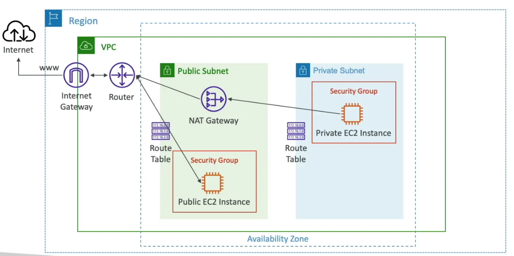

# AWS Bastion Host with NAT Gateway - Terraform

This Terraform configuration creates a bastion host architecture with NAT Gateway on AWS using free tier eligible resources.

## Architecture Overview


## Prerequisites

- 🔧 Terraform >= 1.0
- ☁️ AWS CLI configured with credentials
- 🔑 EC2 Key Pair created in target region

## 🚀 Terraform Deployment Steps

### 1️⃣ Configure Variables

Copy and edit the variables file:
```bash
cp terraform.tfvars.example terraform.tfvars
```

Update `terraform.tfvars`:
```hcl
aws_region = "ap-southeast-1"
project_name = "bastion-demo"
environment = "dev"
key_pair_name = "your-keypair-name"
allowed_ssh_cidr_blocks = ["YOUR_PUBLIC_IP/32"]
```

### 2️⃣ Initialize Terraform

```bash
terraform init
```

This downloads the AWS provider and initializes the working directory.

### 3️⃣ Validate Configuration

```bash
terraform validate
```

Checks syntax and configuration validity.

### 4️⃣ Plan Deployment

```bash
terraform plan
```

Shows what resources will be created:
- 🌐 1 VPC with DNS support enabled
- 🏠 2 Subnets (public/private) in single AZ
- 🌍 1 Internet Gateway for public internet access
- 🔄 1 NAT Gateway with Elastic IP for private subnet internet access
- 🛣️ 2 Route Tables with appropriate routes
- 🛡️ 2 Security Groups with SSH access rules
- 💻 2 EC2 instances (t2.micro, Amazon Linux 2)

### 5️⃣ Deploy Infrastructure

```bash
terraform apply
```

Type `yes` to confirm. Deployment takes 3-5 minutes.

### 6️⃣ Get Connection Details

```bash
terraform output
```

Returns SSH commands and IP addresses for connecting to instances.

## 🔧 Infrastructure Details

### 🌐 Network Configuration

**VPC (10.0.0.0/16)**
- DNS hostnames and resolution enabled
- Single availability zone deployment

**Public Subnet (10.0.1.0/24)**
- Auto-assigns public IPs
- Routes traffic to Internet Gateway
- Hosts bastion host and NAT Gateway

**Private Subnet (10.0.2.0/24)**
- No public IP assignment
- Routes traffic to NAT Gateway for internet access
- Hosts private instances

### 🛡️ Security Groups

**Bastion Security Group**
- Inbound: SSH (port 22) from specified CIDR blocks
- Outbound: All traffic allowed

**Private Security Group**
- Inbound: SSH (port 22) from bastion security group only
- Outbound: All traffic allowed

### 💻 EC2 Instances

**Bastion Host**
- Instance type: t2.micro (free tier)
- AMI: Latest Amazon Linux 2
- Placement: Public subnet
- Public IP: Yes
- User data: Updates packages, installs htop, wget, curl

**Private Instance**
- Instance type: t2.micro (free tier)
- AMI: Latest Amazon Linux 2
- Placement: Private subnet
- Public IP: No
- User data: Updates packages, installs htop, wget, curl

### 🛣️ Routing

**Public Route Table**
- 0.0.0.0/0 → Internet Gateway
- Associated with public subnet

**Private Route Table**
- 0.0.0.0/0 → NAT Gateway
- Associated with private subnet

## 📁 File Structure

```
├── provider.tf         # 🔧 Terraform version and AWS provider
├── data.tf            # 📊 AMI data source
├── vpc.tf             # 🌐 VPC and subnets
├── gateway.tf         # 🌍 Internet Gateway and NAT Gateway
├── routes.tf          # 🛣️ Route tables and associations
├── security_groups.tf # 🛡️ Security group rules
├── ec2.tf            # 💻 EC2 instances
├── variables.tf      # ⚙️ Input variables
├── outputs.tf        # 📤 Output values
└── terraform.tfvars  # 📝 Variable values (create from example)
```

## 🧪 Testing Connectivity

### 🔗 Connect to Bastion Host
```bash
ssh -i ~/.ssh/your-key.pem ec2-user@<bastion-public-ip>
```

### 🔗 Connect to Private Instance via Bastion
```bash
# Direct jump
ssh -i ~/.ssh/your-key.pem -o ProxyCommand='ssh -i ~/.ssh/your-key.pem -W %h:%p ec2-user@<bastion-public-ip>' ec2-user@<private-ip>

# Or two-step: SSH to bastion first, then to private instance
ssh ec2-user@<private-ip>
```

### ✅ Verify Internet Access
From private instance:
```bash
ping google.com
curl ifconfig.me  # Should return NAT Gateway public IP
```

## 🔧 Terraform Commands

### 👀 View Current State
```bash
terraform show
terraform state list
```

### 📤 Get Specific Outputs
```bash
terraform output bastion_public_ip
terraform output ssh_command_bastion
```

### 🔄 Update Infrastructure
```bash
# After modifying .tf files
terraform plan
terraform apply
```

### 💥 Destroy Infrastructure
```bash
terraform plan -destroy
terraform destroy
```

## 💰 Cost Considerations

**💚 Free Tier Eligible:**
- t2.micro instances: 750 hours/month each
- EBS storage: 30GB total
- Data transfer: 15GB outbound

**💸 Ongoing Costs:**
- NAT Gateway: ~$32/month (not free tier)
- Elastic IP: Free when attached to running instance

## 🔍 Troubleshooting

### ⚠️ Common Issues

**❌ Terraform Init Fails**
- Check internet connectivity
- Verify Terraform version
- Clear `.terraform` directory and retry

**❌ Apply Fails - Key Pair Not Found**
- Ensure key pair exists in target region
- Verify key pair name in terraform.tfvars

**❌ SSH Connection Refused**
- Check security group allows your IP
- Verify instance is running
- Confirm key file permissions (chmod 400)

**❌ Private Instance No Internet**
- Verify NAT Gateway is running
- Check route table associations
- Confirm security group egress rules

### 🛠️ Useful Debug Commands
```bash
# Check AWS credentials
aws sts get-caller-identity

# Verify region and AZ
aws ec2 describe-availability-zones --region ap-southeast-1

# List key pairs
aws ec2 describe-key-pairs --region ap-southeast-1

# Check your public IP
curl ifconfig.me
```

## 🧹 Cleanup

To remove all resources:
```bash
terraform destroy
```
